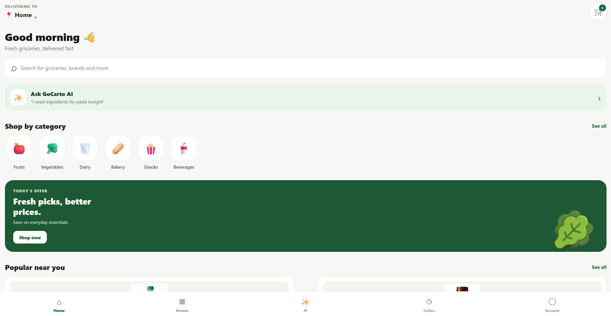
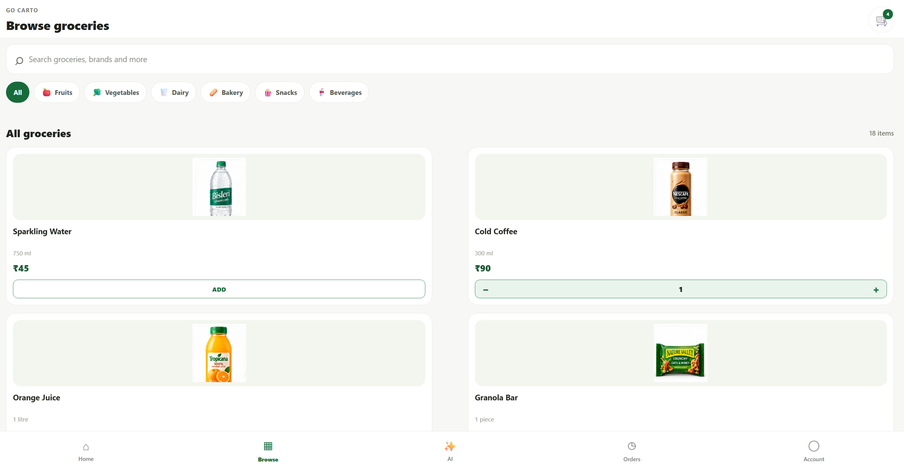
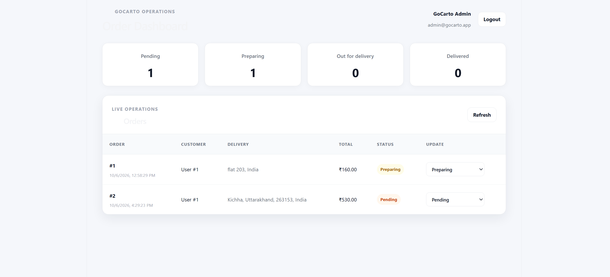
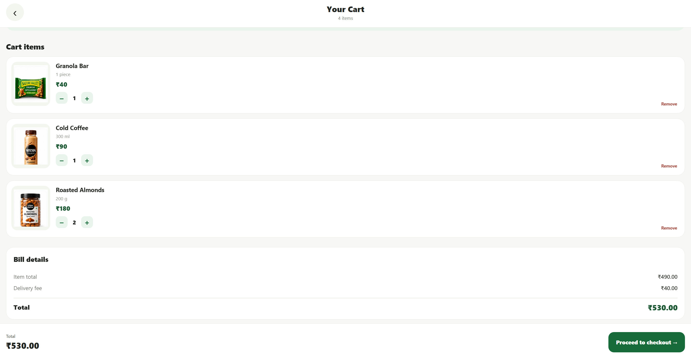
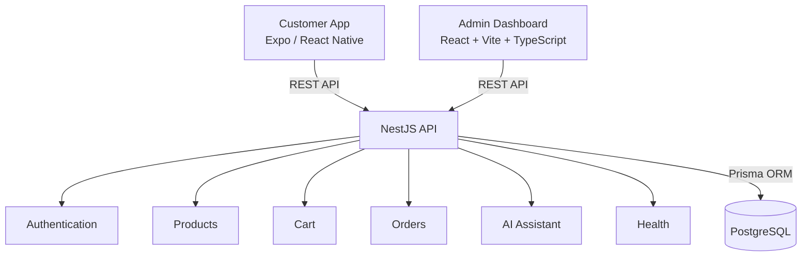

# 🛒 GoCarto

### AI-Powered Quick-Commerce Grocery Platform

[](https://www.typescriptlang.org/)
[](https://nestjs.com/)
[](https://reactnative.dev/)
[](https://expo.dev/)
[](https://www.postgresql.org/)
[](https://www.prisma.io/)
[](https://jestjs.io/)

> A full-stack quick-commerce grocery platform combining a customer shopping experience, admin operations dashboard, secure backend APIs, real order workflows, and an AI-powered shopping assistant.

### 🌐 Live Demo

| Application | Link |
|---|---|
| 🛒 Customer App | https://gocarto-customer.expo.app |
| 🧑‍💼 Admin Dashboard | https://gocarto-admin.onrender.com |
| ⚙️ Backend API | https://gocarto.onrender.com |

---

## 📸 Project Screenshots

### 🏠 Customer App



### 🛒 Grocery Browsing



### 🤖 AI Shopping Assistant


### 🧑‍💼 Admin Dashboard



### 🛍️ Cart & Checkout



 ---

## ✨ Overview

GoCarto is an AI-powered quick-commerce grocery platform built as a full-stack engineering project.

It covers the complete grocery ordering journey:

**Discover products → Build cart → Choose delivery location → Checkout → Place order → Manage orders**

The project focuses on real-world application workflows, backend business logic, authentication, authorization, testing, security, deployment, and AI-assisted shopping rather than a basic CRUD implementation.

---

## 🚀 Features

### 🛒 Customer Shopping

- Product catalogue
- Product discovery and search
- Category-based browsing
- Real product imagery
- Add to cart
- Increase/decrease product quantities
- Cart management
- Checkout flow
- Cash on Delivery
- Order history
- Order details

### 📍 Delivery & Orders

- Delivery address search
- Geocoded latitude and longitude
- Order creation
- Order history
- Order status tracking
- Controlled order status transitions
- Order cancellation flows

### 🧑‍💼 Admin Operations

- Admin authentication
- Admin dashboard
- Order overview
- Pending order counts
- Order totals
- Customer and order information
- Delivery location information
- Order status management

### 🤖 AI Shopping Assistant

GoCarto includes an AI-powered shopping assistant connected to real application functionality.

Example interactions:

```text
"banana ka price kya hai?"

"2 bananas cart mein daal do"

"Fresh Bananas stock mein hai kya?"
```

The assistant can work with product information, inventory information, and supported shopping actions through controlled backend functionality.

The goal is to make AI useful inside the commerce workflow rather than building a standalone chatbot disconnected from application data.

---

## 📦 Order Lifecycle

```text
Pending
   ↓
Confirmed
   ↓
Preparing
   ↓
Out for Delivery
   ↓
Delivered
```

The backend enforces supported order status transitions and cancellation flows.

---

## 🏗️ Architecture



The architecture separates customer-facing shopping, operational administration, backend business logic, and persistent data storage behind a controlled API layer.

---

## 🧩 Monorepo Structure

```text
GoCarto/
│
├── apps/
│   ├── api/                 # NestJS backend API
│   ├── customer/            # Expo / React Native customer app
│   └── admin/               # React / Vite admin dashboard
│
├── apps/api/migrations/app/ # Database migrations
├── package.json             # Monorepo configuration
├── package-lock.json
└── README.md
```

---

## 🛠️ Tech Stack

| Area | Technologies |
|---|---|
| Customer App | React Native, Expo, TypeScript |
| Admin Dashboard | React, Vite, TypeScript |
| Backend | NestJS, TypeScript |
| Authentication | JWT, bcrypt |
| Validation | class-validator |
| Database | PostgreSQL |
| ORM | Prisma |
| Logging | Pino |
| Security | Helmet, CORS, Rate Limiting |
| Testing | Jest, Supertest |
| AI | LLM-powered shopping assistant |
| Package Management | npm Workspaces |

---

## 🔐 Security & Backend Engineering

The backend includes production-minded foundations:

- JWT authentication
- Role-based authorization
- Password hashing with bcrypt
- Request validation
- Global exception handling
- Helmet security headers
- CORS configuration
- API rate limiting
- Request ID middleware
- Structured logging
- Environment-based configuration
- Customer resource ownership checks
- Controlled order status transitions

Real credentials and environment secrets are excluded from version control.

---

## 🧪 Testing

The API has been verified with automated tests.

### End-to-End API Tests

```text
6 test suites
89 tests
89 passed
```

Additional verification includes:

- API TypeScript compilation
- Customer TypeScript compilation
- Admin production build
- Customer web export
- API unit tests
- API end-to-end tests
- Customer authentication
- Product browsing
- Cart quantity controls
- Checkout
- Order creation
- Order lifecycle
- Admin order management
- AI product queries
- AI cart actions

---

## 🤖 AI Architecture

The AI layer is designed around controlled application functionality.

Supported application-level capabilities include:

- Product lookup
- Price lookup
- Inventory lookup
- Cart actions

The assistant does not receive unrestricted database access. Supported actions are handled through backend application logic.

### Future AI Capabilities

- Advanced tool/function calling
- Retrieval-augmented generation
- Product knowledge retrieval
- FAQ and policy assistance
- Order-aware customer support
- Personalized shopping assistance
- AI-powered shopping lists

---

## 📱 Customer Experience

```text
Login
  ↓
Browse Products
  ↓
Product Discovery
  ↓
Add / Update Cart
  ↓
Checkout
  ↓
Delivery Location
  ↓
Payment Method
  ↓
Place Order
  ↓
Order History
```

The customer application uses real product imagery and quantity controls to provide a realistic quick-commerce shopping experience.

---

## 🧑‍💼 Admin Experience

```text
Admin Login
     ↓
Dashboard
     ↓
View Orders
     ↓
Inspect Order
     ↓
Update Order Status
     ↓
Complete Order Lifecycle
```

The admin dashboard separates customer-facing shopping functionality from operational order management.

---

## ☁️ Deployment

GoCarto is deployed as a production-style full-stack application:

- **Backend API:** Render
- **PostgreSQL Database:** Neon
- **Customer Web App:** Expo
- **Admin Dashboard:** Render Static Site

Production environments use environment-based configuration and keep credentials outside version control.

### Production Validation

The deployed application has been manually verified across the complete order workflow:

- Customer authentication
- Product browsing
- Cart management
- Checkout
- Order creation
- Order persistence
- Admin order visibility
- Admin order status updates
- Customer-side order status updates
- Customer → API → Database → Admin → API → Customer flow

---

## 🚧 Roadmap

### Commerce

- Online payment gateway
- Inventory reservation
- Promotions and coupons
- Advanced catalogue management

### Delivery

- Delivery partner application
- Real-time delivery tracking
- Maps and route optimization
- Delivery assignment
- ETA calculation

### Infrastructure

- Redis caching
- Background job processing
- Push notifications
- CI/CD improvements
- Autoscaling
- Advanced production infrastructure

### AI

- Advanced tool/function calling
- RAG for product and policy knowledge
- Order-aware customer support
- Personalized recommendations
- AI-powered shopping lists

### Observability & Security

- Distributed tracing
- Advanced monitoring
- Centralized observability
- Fraud and abuse protection
- Further production security hardening
- Secrets rotation and managed secret storage

---

## ⚙️ Local Development

### Prerequisites

- Node.js
- npm
- PostgreSQL
- Git

### Clone

```bash
git clone https://github.com/Sambhav587/GoCarto.git
cd GoCarto
```

### Install Dependencies

```bash
npm install
```

### Environment Configuration

Configure the required environment variables for the API and customer app using local `.env` files.

Never commit real credentials or API keys.

### Start the API

```bash
cd apps/api
npm run start:dev
```

### Start the Customer App

```bash
cd apps/customer
npx expo start
```

### Start the Admin Dashboard

```bash
cd apps/admin
npm run dev
```

---

## 👨‍💻 Author

**Sambhav**

Full-stack developer building GoCarto as an AI-powered quick-commerce engineering project.

### GitHub

https://github.com/Sambhav587/GoCarto

---

## 📄 License

See the repository license file for licensing information.
